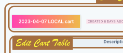

# 🛍 Multi-Cart — a fake fancy shopping cart

 

* [multicart.app](https://multicart.app/)

This is a full-stack **React** **serverless** web application built for demo and study purposes while I was learning React, GraphQL, and other tech. 

`NOTE:` In April 2023, I upgraded most of the shopping cart code, guided by React principles and best practices learned over the past couple years, detailed in the section below. 

# ✅ Tasks: 

- [ ] ==once done, deploy all to DEV, then make ONE permanent link, find the blob ID, and then VSCODE > replace 'em all here==

# 📐 2023: Guiding Principles and Best Practices

*Where applicable, I've linked to relevant code samples:*

- component **composition** (eg. `drawerHeader={<SearchBar...`) eg. [1](https://github.com/charlieargue/multi-cart/blob/db080813913a6ea53355ac01aaf544e94c90dea2/libs/react-shared-components/src/lib/_layout/nav-bar/NavBar.tsx#L74) [2](https://github.com/charlieargue/multi-cart/blob/db080813913a6ea53355ac01aaf544e94c90dea2/libs/react-shared-components/src/lib/line-account/drawer-container/DrawerContainer.tsx#L60) [3](https://github.com/charlieargue/multi-cart/blob/db080813913a6ea53355ac01aaf544e94c90dea2/apps/multi-cart/appViews/auth/RegisterContainer.tsx#L8-L9)
- minimal **state management**
- minimal `useEffects`, and **encapsulation** into custom hooks where appropriate, eg. [1](https://github.com/charlieargue/multi-cart/blob/db080813913a6ea53355ac01aaf544e94c90dea2/libs/react-data-access/src/lib/hooks/useSaveAsCurrentCart.ts) [2](https://github.com/charlieargue/multi-cart/blob/db080813913a6ea53355ac01aaf544e94c90dea2/apps/multi-cart/appViews/EditCartContainer.tsx#L18)
- strongly-typed **auto-generated** React hooks from graphql schema (by codegen), eg. [1](https://github.com/charlieargue/multi-cart/blob/db080813913a6ea53355ac01aaf544e94c90dea2/libs/react-data-access/src/lib/generated/graphql.ts)
- Typescript, eg. [1](https://github.com/charlieargue/multi-cart/blob/db080813913a6ea53355ac01aaf544e94c90dea2/libs/react-shared-components/src/lib/auth/login-form/LoginForm.types.tsx)
- clear **componentization** and hierarchy, eg. [1](https://github.com/charlieargue/multi-cart/blob/db080813913a6ea53355ac01aaf544e94c90dea2/apps/multi-cart/component-guides/EditCart-Component-GUIDE.png) (in `react-shared-components` library)
- **simple**, short functions, components, and files (under 200 lines) that are [D.R.Y.](https://en.wikipedia.org/wiki/Don%27t_repeat_yourself) and [S.R.P.](https://en.wikipedia.org/wiki/Single-responsibility_principle)
- Clean and no unnecessary **comments**
- [Avoided Hasty Abstractions](https://kentcdodds.com/blog/aha-programming) and [Rule of Threes](https://en.wikipedia.org/wiki/Rule_of_three_(computer_programming)) 
- performant **data-fetching** (no unnecessary API calls)
- **testable** components, with minimal dependencies and allowing easy-mocking with msw
- **"Smart"** container vs "Dumb" component (loosely, not strictly)

# 👾 2023: Front-end Code Samples

*Please see this **"Component Guide"** easily reference what components make-up what UI/UX:*

### React Code Samples:

* A user can [make a new cart](https://github.com/charlieargue/multi-cart/blob/2023-04-19-README-finishing-edits/libs/react-shared-components/src/lib/cart/new-cart-button/NewCartButton.tsx) (via the NavBar > CartMenu dropdown)

* They can then edit that cart:

  * [EditCartPage](https://github.com/charlieargue/multi-cart/blob/db080813913a6ea53355ac01aaf544e94c90dea2/apps/multi-cart/pages/cart/%5Bid%5D.tsx)
    * [EditCartContainer](https://github.com/charlieargue/multi-cart/blob/db080813913a6ea53355ac01aaf544e94c90dea2/apps/multi-cart/appViews/EditCartContainer.tsx)
      * [EditCartTable](https://github.com/charlieargue/multi-cart/blob/db080813913a6ea53355ac01aaf544e94c90dea2/libs/react-shared-components/src/lib/cart/edit-cart-table/EditCartTable.tsx)
        * [CartLineContainer](https://github.com/charlieargue/multi-cart/blob/db080813913a6ea53355ac01aaf544e94c90dea2/libs/react-shared-components/src/lib/cart/cart-line-container/CartLineContainer.tsx)
          *  [CartLineForm](https://github.com/charlieargue/multi-cart/blob/db080813913a6ea53355ac01aaf544e94c90dea2/libs/react-shared-components/src/lib/cart/cart-line-form/CartLineForm.tsx)
          *  [LineAccountsContainer](https://github.com/charlieargue/multi-cart/blob/db080813913a6ea53355ac01aaf544e94c90dea2/libs/react-shared-components/src/lib/line-account/line-accounts-container/LineAccountsContainer.tsx)
            * [DrawerContainer](https://github.com/charlieargue/multi-cart/blob/db080813913a6ea53355ac01aaf544e94c90dea2/libs/react-shared-components/src/lib/line-account/drawer-container/DrawerContainer.tsx#L20)
            * [LineAccount](https://github.com/charlieargue/multi-cart/blob/db080813913a6ea53355ac01aaf544e94c90dea2/libs/react-shared-components/src/lib/line-account/line-account/LineAccount.tsx)
            * [AutoSave](https://github.com/charlieargue/multi-cart/blob/db080813913a6ea53355ac01aaf544e94c90dea2/libs/react-shared-components/src/lib/auto-save/AutoSave.tsx)

* Other code samples (not React):

  * Custom [incoming webhook](https://github.com/charlieargue/multi-cart/blob/db080813913a6ea53355ac01aaf544e94c90dea2/apps/multi-cart/pages/api/webhook-incoming.ts) (**devops glue** between Terraform Cloud and GitHub Actions)

  * Custom **urql** [Graphcache](https://github.com/charlieargue/multi-cart/blob/db080813913a6ea53355ac01aaf544e94c90dea2/libs/react-data-access/src/lib/urql-customizations/cache.ts) and [GlobalFetching](https://github.com/charlieargue/multi-cart/blob/db080813913a6ea53355ac01aaf544e94c90dea2/libs/react-data-access/src/lib/urql-customizations/createUrqlClient.ts) exchanges

# Table of Contents

1. [✈️ 10,000 Foot View](docs/readme/01-ten-thousand-foot-view.md)
2. [▶️ Demo Reels](docs/readme/02-demo-reels.md)
3. [🎯 Purpose](docs/readme/03-purpose.md)
4. [🚀 Technologies Used](docs/readme/04-technologies-used.md)
5. [👨🏻‍💻 Installation and Quick Start](docs/readme/05-installation-quick-start.md)
6. [🗂 Repo Overview](docs/readme/06-repo-overview.md)
7. [👩‍🔬 Testing Pyramid](docs/readme/07-testing-pyramid.md)
8. [⛅️ CI/CD](docs/readme/08-cicd.md)
9. [🐞 Known Issues and Future Enhancements](docs/readme/09-known-issues-and-future-enhancements.md)
10. [⚙️ Helpful Commands](docs/readme/10-helpful-commands.md)
11. [🔋Backend Code Samples](docs/readme/11-backend-code-samples.md)

# Other Info:

* ✉️ **Contact**: my personal website is https://karlgolka.com/ and you can email me at contact@karlgolka.com 

* 📝 **License**: [MIT](https://github.com/charlieargue/multi-cart/blob/develop/LICENSE)

* **🌥 Cloud Providers:**

| [Vercel](https://vercel.com/charlieargue/multi-cart/deployments) deployments | [GitHub](https://github.com/charlieargue/multi-cart/actions)  actions | [Terraform Cloud](https://app.terraform.io/app/multi-cart/workspaces/multi-cart-dev/runs) dev runs | [Cypress](https://dashboard.cypress.io/organizations/d27854b3-693d-41fe-8fb8-55bac52ed996/projects) dashboard | [AWS](https://console.aws.amazon.com/) console |
| ------------------------------------------------------------ | ------------------------------------------------------------ | ------------------------------------------------------------ | ------------------------------------------------------------ | ---------------------------------------------- |
